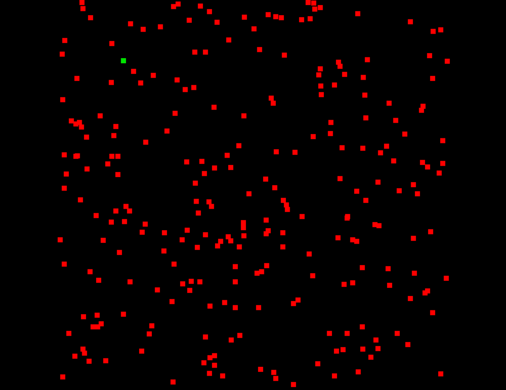

# 00_random

This project simulate the simplest optimization process.  
  
## Initial configuration  
There are 500 of randomly generated points in the frame.  
  
## Simulation  
1. A random dot is generated in each frame.  
2. The square norm is calculated from each point and the dot.  
3. If that square norm is the minimum, note the value.  
4. Continue the same process until there is no step within 1000 frames.  
