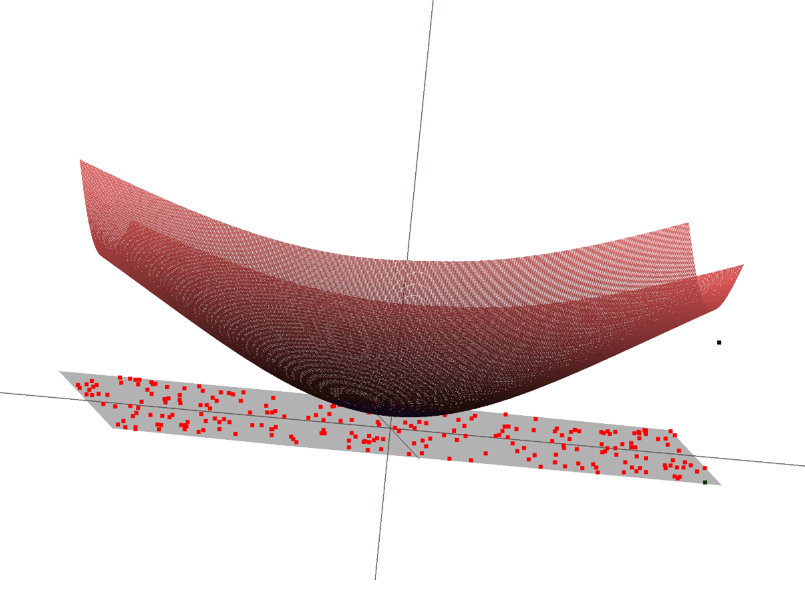

# 01_gradient_descent3d

  
  
  

This project is 3d version of project 01_gradient_descent3d   
  
## Initial configuration  
250 points are randomly generated on the OpenGL window.  
  
## Simulation  
1. A target point is generated on the top-right position on the window.
2. Gradient of square error is calculated at the current target position.
3. The target point moves in the opposite direction of the gradient.
4. Iterate above 1 ~ 3 until the calculated gradient is lower than a certain value ( ideally, gradient converges to zero).
