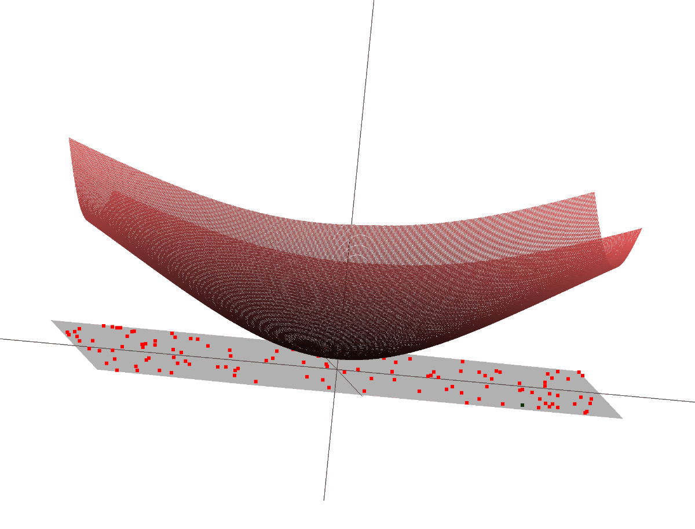
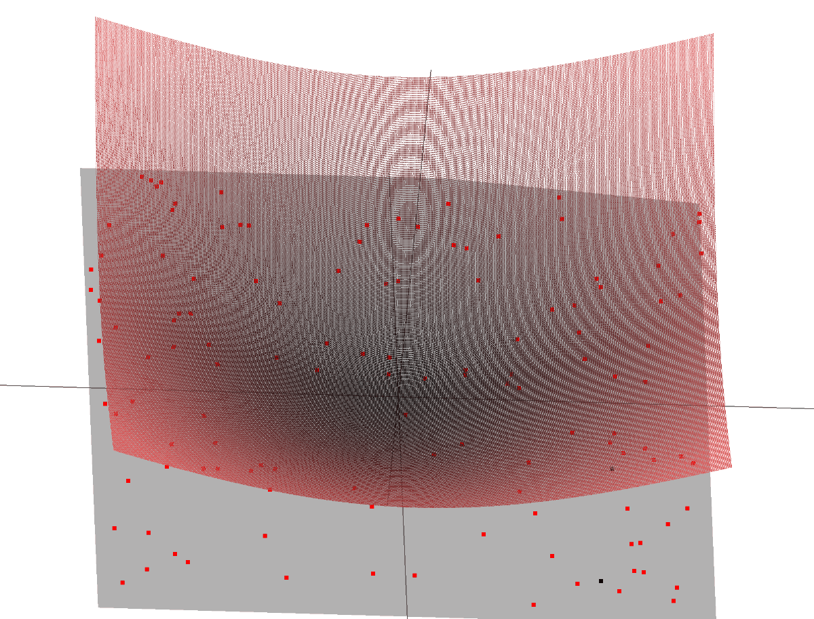
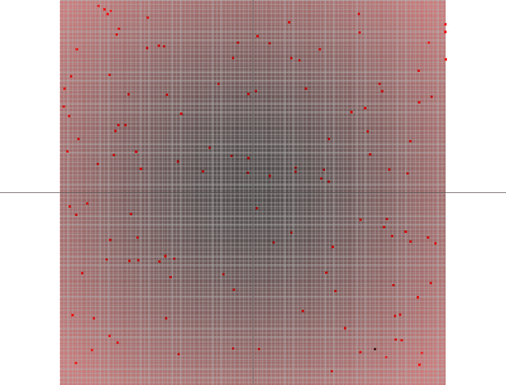
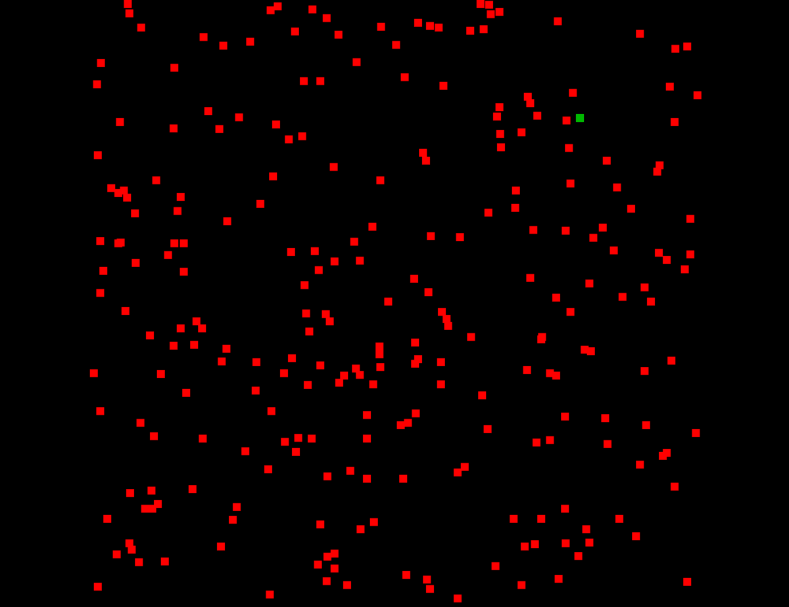
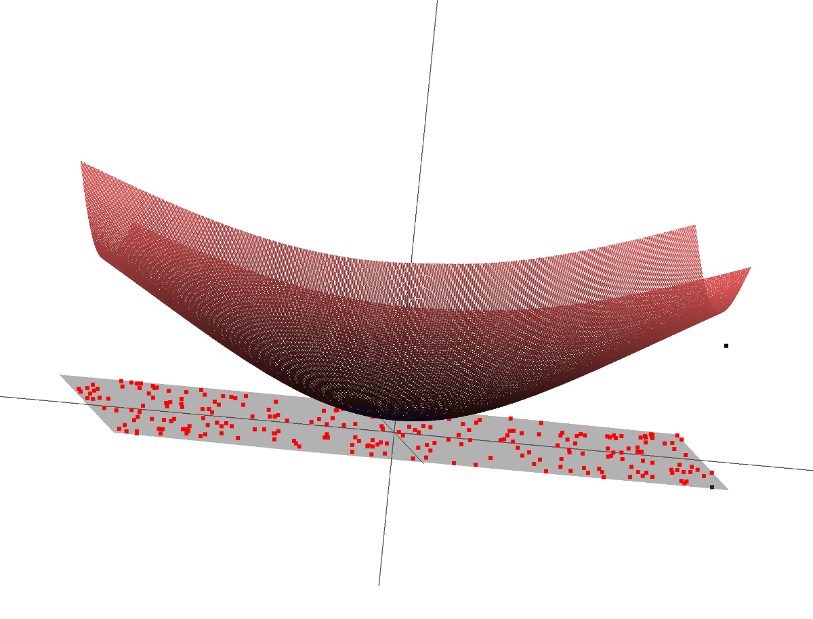
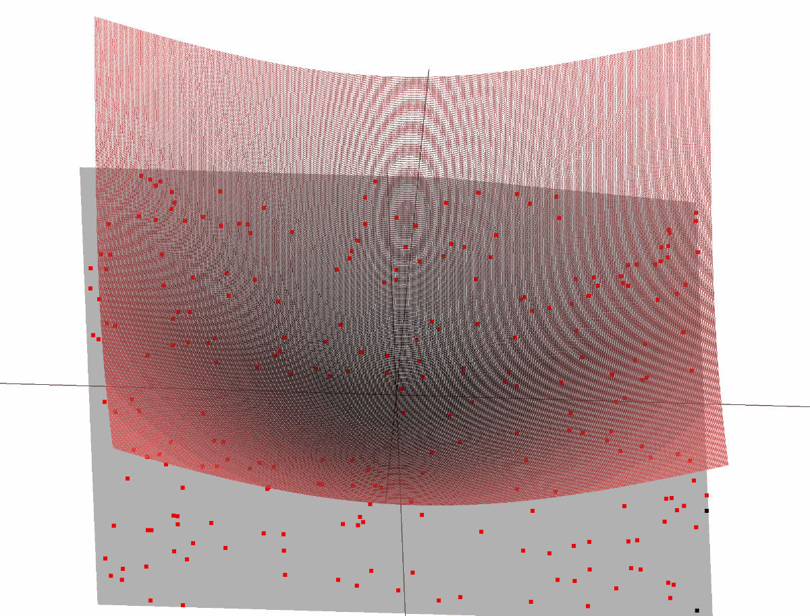
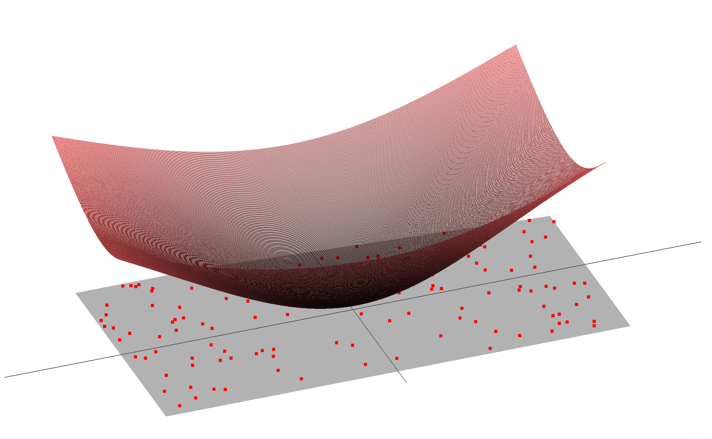

# optimization  
  
Optimization methods are used in a wide range of engineering fields.  
These methods are mainly classified as follows  
1. **linear optimization methods** where all variables in the objective function and conditional equation are linear
2. **nonlinear optimization methods** that include nonlinear objective functions and conditional equations
3. **discrete optimization methods** that deal with discrete variables
  
This repository deals mainly with unconstrained nonlinear optimization. In particular, projects **00_random** ~ **04_square_error_visualization** provide an elementary demonstration of how to find the point **r**k, that minimizes the sum of the squares of the distances from several randomly scattered points in the Gaussian plane, Ek = Σi=0, .., n | **r**i - **r**k |^2 , using various optimization methods.  

## 00_random


The first method is a **completely random search** for the optimal point.  
First, a given number of random points are scattered on the Gaussian plane (red dots). Then, for each frame k, one random point **r**k is generated on the same plane (green point). If the sum of the squares of the distances from this point to each random point Ek is the smallest ever recorded, then this point is recorded as the optimal solution and drawn on the screen. If this point is inferior to the provisional optimal solution, this value will be discarded. The frames are updated one after another, and the simulation terminates when the optimal solution has not been updated for the first time 1000 times in a row.  
The last recorded point is the solution to this optimization problem.  

### 00_random3d  


  

The projects marked "3d" at the end of each project are demonstrations of the respective optimization method on a 3d plot of squared error. The convex red graph is the value of the squared error at the xy coordinate plotted on the z-axis. The higher this height, the larger the error, and the further from the optimal solution. We want to find the point where this height is minimized.  
  
In the simulation, we can see that we start from a non-optimal position and gradually converge to the lowest point with each successive frame.  
  
## 01_gradient_descent
  

The **gradient descent method** uses the value of the gradient of the squared error **∇**E as the direction of the search.  
  
First, as in the previous project, a given number of random points are scattered on the plane (red dots). Next, a suitable initial position is given (in this project, it is generated in the first quadrant (500, 500) of the plane).  
The first step in the simulation is to find the gradient *∇*E of the squared error at the current candidate point.  The gradient is obtained by partial differentiating E at x and y respectively, and this direction is perpendicular to the contours of E. In each frame of the simulation, the search proceeds one after another in the direction of this gradient, and finally converges to the point where the gradient approaches zero, i.e., the optimal solution.  

The gradient descent method converges to the optimal solution faster and better than the completely random method, but it requires us to find the value of how far we can go in one step in the search direction (step width). In this project, this value is given as a hyperparameter (lr). By changing this value, we can see that the way the solution moves changes.  
  
### 01_gradient_descent3d




## 02_levenberg_marquardt

## 03_newton_raphson

## 04_gauss_newton

## 04_square_error_visualization
  
  
This project simply displays the value of the squared error E by plotting it on a 3D graph.
Therefore, it can be utilized when you want to check the appearance of the objective function without proceeding with the simulation.  
  
  
# How to Install  
  
Clone this repository "optimization".  
`https://github.com/goto-c/optimization.git`  

Go to the optimization directory.  
`cd optimization`
  
Clone the submodule "glfw" for OpenGL.  
`git submodule update --init --recursive`

Compile glfw with cmake and generate the executable file.  
```
cd 3rd_party/glfw  
cmake .  
make  
```  
  
Create a build directory for this project and build it there. We are using cmake and Xode for the build, but you can use whatever you like.
```
cd ../../  
mkdir build  
cd build  
cmake -G Xcode ..
```  

Open the generated Xcode project, run it, and the optimization simulation should start.  

# Tested Environment  
  
Xcode : Version 12.4  
cmake : Version 3.19.5  
GLFW : Version 3.3.2  
GLAD : Version 3.3  
  
This project has been developed under mac environment and has been tested only on mac.
Support for windows and linux will be added in due course.  


